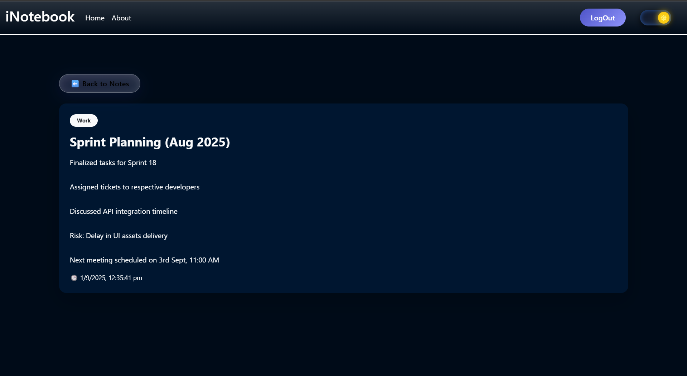
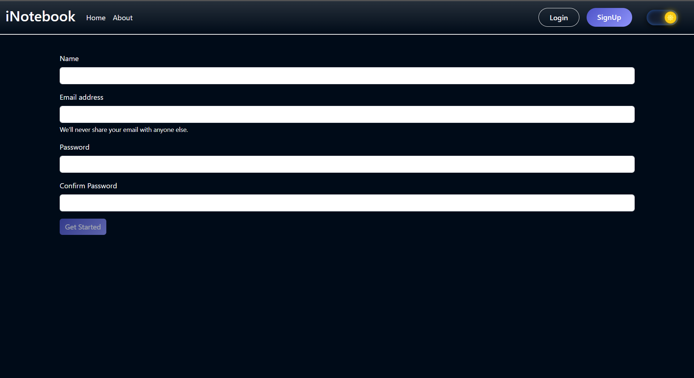

# 🧠 iNotebook — Your Personal Cloud Notebook

> ✨ A full-stack MERN app that lets you securely create, edit, delete, and organize personal notes — accessible anytime, anywhere!

---

<div align="center">

[](https://github.com/sumitdwivedi01/iNotebook/stargazers)
[](https://github.com/sumitdwivedi01/iNotebook/network/members)
[](https://github.com/sumitdwivedi01/iNotebook/issues)
[](https://github.com/sumitdwivedi01/iNotebook/pulls)

</div>

---

## 🌟 About the Project
**iNotebook** is a secure and responsive **MERN stack** web app that allows users to take notes in the cloud with authentication and privacy.  
Users can **sign up**, **log in**, and **manage their notes** (Create, Read, Update, Delete) with smooth React UI and MongoDB backend.

---

## 🚀 Features

✅ **User Authentication** — Secure login & signup using JWT  
✅ **Add, Edit & Delete Notes** — Real-time state updates via React  
✅ **Cloud Storage** — All notes saved in MongoDB Atlas  
✅ **Responsive UI** — Mobile & desktop friendly  
✅ **Private Routes** — User-specific data access only  
✅ **Smart Alerts** — Clean UI feedback system  
✅ **Secure Backend** — Token validation + password encryption  

---

## 🖼️ App Preview

> Add your screenshots inside `/assets` and replace below 👇

<div align="center">





</div>

---

## 🌙 Technologies Used

<div align="center">

| React | Node.js | Express | MongoDB | Bootstrap |
|:------:|:--------:|:--------:|:--------:|:-----------:|
|  |  |  |  |  |

</div>

---

## ⚙️ Setup Instructions

### 1️⃣ Clone the repository
```bash
git clone https://github.com/sumitdwivedi01/iNotebook.git
cd iNotebook
2️⃣ Install dependencies
bash
Copy code
npm install
3️⃣ Configure environment variables
Create a .env file in the backend directory:

ini
Copy code
MONGO_URI = your_mongodb_connection_string
JWT_SECRET = your_secret_key
4️⃣ Run backend server
bash
Copy code
cd backend
npm start
5️⃣ Run frontend
bash
Copy code
cd ../frontend
npm run dev
✅ App will be live at → http://localhost:5173/

🗂️ Folder Structure
pgsql
Copy code
iNotebook/
│
├── backend/
│   ├── index.js
│   ├── routes/
│   ├── models/
│   └── middleware/
│
├── frontend/
│   ├── src/
│   │   ├── components/
│   │   ├── context/
│   │   ├── pages/
│   │   └── App.js
│   └── package.json
│
└── assets/
    ├── dashboard.png
    ├── editnote.png
    └── login.png
🔮 Future Enhancements
✨ Dark mode toggle
✨ Categorized & searchable notes
✨ Rich text formatting (bold, highlight, lists)
✨ Share notes between users
✨ PWA support for offline access

👨‍💻 Author
Sumit Dwivedi
🎓 B.Tech CSE | MERN Developer | Lifelong Learner
🌐 GitHub • LinkedIn

💖 Support
If you found this project helpful, please ⭐ it on GitHub
and feel free to open an issue or pull request 🚀

<div align="center">
Made with ❤️ by Sumit Dwivedi

</div> ```